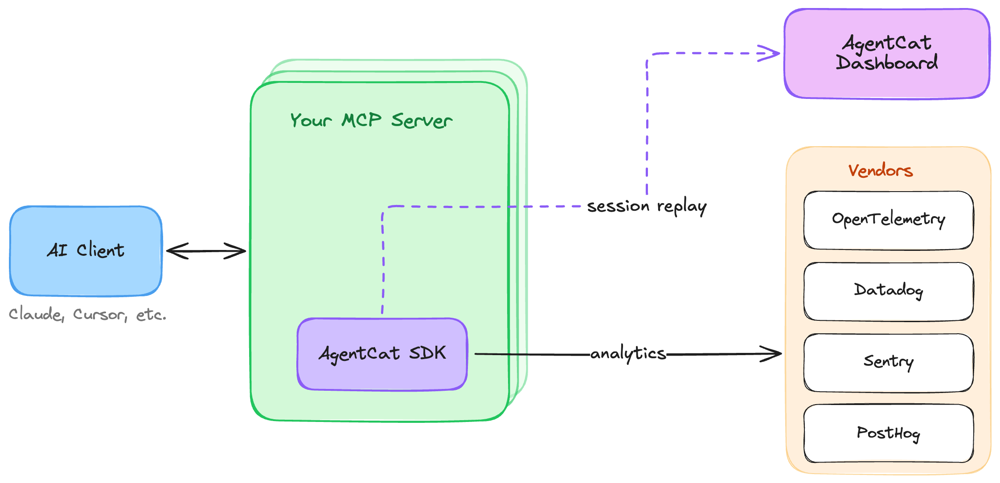

<div align="center">
  
</div>
<h3 align="center">
    <a href="#getting-started">Getting Started</a>
    <span> · </span>
    <a href="#why-use-agentcat-">Features</a>
    <span> · </span>
    <a href="https://docs.agentcat.com">Docs</a>
    <span> · </span>
    <a href="https://agentcat.com">Website</a>
    <span> · </span>
    <a href="#free-for-open-source">Open Source</a>
    <span> · </span>
    <a href="https://meet.agentcat.com/meet">Schedule a Demo</a>
</h3>
<p align="center">
  <a href="https://badge.fury.io/py/agentcat"></a>
  <a href="https://pypi.org/project/agentcat/"></a>
  <a href="https://opensource.org/licenses/MIT"></a>
  <a href="https://www.python.org/"></a>
  <a href="https://github.com/agentcathq/agentcat-python-sdk/issues"></a>
  <a href="https://github.com/agentcathq/agentcat-python-sdk/actions"></a>
</p>

> [!IMPORTANT]
> **MCPCat is now AgentCat** 🐱 — same team, same product, new name. This package was previously published as [`mcpcat`](https://pypi.org/project/mcpcat/), which keeps working forever, but new features land here. Upgrading takes a few minutes — see the [migration guide](./MIGRATION.md).

> [!NOTE]
> Looking for the TypeScript SDK? Check it out here [agentcat-typescript](https://github.com/agentcathq/agentcat-typescript-sdk).

AgentCat is an analytics platform for MCP server owners 🐱. It captures user intentions and behavior patterns to help you understand what AI users actually need from your tools — eliminating guesswork and accelerating product development all with one-line of code.

This SDK also provides a free and simple way to forward telemetry like logs, traces, and errors to any Open Telemetry collector or popular tools like Datadog and Sentry.

```bash
# Basic installation (includes official MCP SDK)
pip install agentcat

# With Jlowin's/Prefect's FastMCP support
pip install "agentcat[community]"
```

To learn more about us, check us out [here](https://agentcat.com)

## Why use AgentCat? 🤔

AgentCat helps developers and product owners build, improve, and monitor their MCP servers by capturing user analytics and tracing tool calls.

Use AgentCat for:

- **User session replay** 🎬. Follow alongside your users to understand why they're using your MCP servers, what functionality you're missing, and what clients they're coming from.
- **Trace debugging** 🔍. See where your users are getting stuck, track and find when LLMs get confused by your API, and debug sessions across all deployments of your MCP server.
- **Existing platform support** 📊. Get logging and tracing out of the box for your existing observability platforms (OpenTelemetry, Datadog, Sentry) — eliminating the tedious work of implementing telemetry yourself.



## Getting Started

To get started with AgentCat, first create an account and obtain your project ID by signing up at [agentcat.com](https://agentcat.com). For detailed setup instructions visit our [documentation](https://docs.agentcat.com).

Once you have your project ID, integrate AgentCat into your MCP server:

```python
import agentcat
from mcp.server import FastMCP

server = FastMCP(name="echo-mcp", version="1.0.0")

agentcat.track(server, "proj_0000000")
```

### Identifying users

You can identify your user sessions with a simple callback AgentCat exposes, called `identify`.

```python
from agentcat import AgentCatOptions, UserIdentity

def identify_user(request, extra):
    user = myapi.get_user(request.params.arguments.token)
    return UserIdentity(
            user_id=user.id,
            user_name=user.name,
            user_data={
                "favorite_color": user.favorite_color,
            },
    )

agentcat.track(server, "proj_0000000", AgentCatOptions(identify=identify_user))
```

### Redacting sensitive data

AgentCat redacts all data sent to its servers and encrypts at rest, but for additional security, it offers a hook to do your own redaction on all text data returned back to our servers.

```python
from agentcat import AgentCatOptions

# Sync version
def redact_sync(text):
    return custom_redact(text)

agentcat.track(server, "proj_0000000", AgentCatOptions(redact_sensitive_information=redact_sync))
```

### Forwarding data to existing observability platforms

AgentCat seamlessly integrates with your existing observability stack, providing automatic logging and tracing without the tedious setup typically required. Export telemetry data to multiple platforms simultaneously:

```python
import os

from agentcat import AgentCatOptions

agentcat.track(
    server,
    "proj_0000000", # Or None if you just want to use the SDK to forward telemetry
    AgentCatOptions(
        exporters={
            # OpenTelemetry - works with Jaeger, Tempo, New Relic, etc.
            "otlp": {
                "type": "otlp",
                "endpoint": "http://localhost:4318/v1/traces",
            },
            # Datadog
            "datadog": {
                "type": "datadog",
                "api_key": os.getenv("DD_API_KEY"),
                "site": "datadoghq.com",
                "service": "my-mcp-server",
            },
            # Sentry
            "sentry": {
                "type": "sentry",
                "dsn": os.getenv("SENTRY_DSN"),
                "environment": "production",
            },
        }
    )
)
```

Learn more about our free and open source [telemetry integrations](https://docs.agentcat.com/telemetry/integrations).

### Internal diagnostics

To help us catch and fix broken installs, the SDK sends AgentCat a small, anonymized
signal when setup or runtime errors occur — never your tool calls, your responses,
or anything about your users. Records carry only operational metadata, such as your
project ID (or an anonymous install ID when none is set). Your local `~/agentcat.log`
is unchanged.

Diagnostics are on by default and can be turned off completely with either:

- `track(server, project_id, AgentCatOptions(disable_diagnostics=True))`, or
- the `DISABLE_DIAGNOSTICS` environment variable.

## Free for open source

AgentCat is free for qualified open source projects. We believe in supporting the ecosystem that makes MCP possible. If you maintain an open source MCP server, you can access our full analytics platform at no cost.

**How to apply**: Email hi@agentcat.com with your repository link

_Already using AgentCat? We'll upgrade your account immediately._

## Community Cats 🐱

Meet the cats behind AgentCat! Add your cat to our community by submitting a PR with your cat's photo in the `docs/cats/` directory.

<div align="left">
  
  
</div>

_Want to add your cat? Create a PR adding your cat's photo to `docs/cats/` and update this section!_
