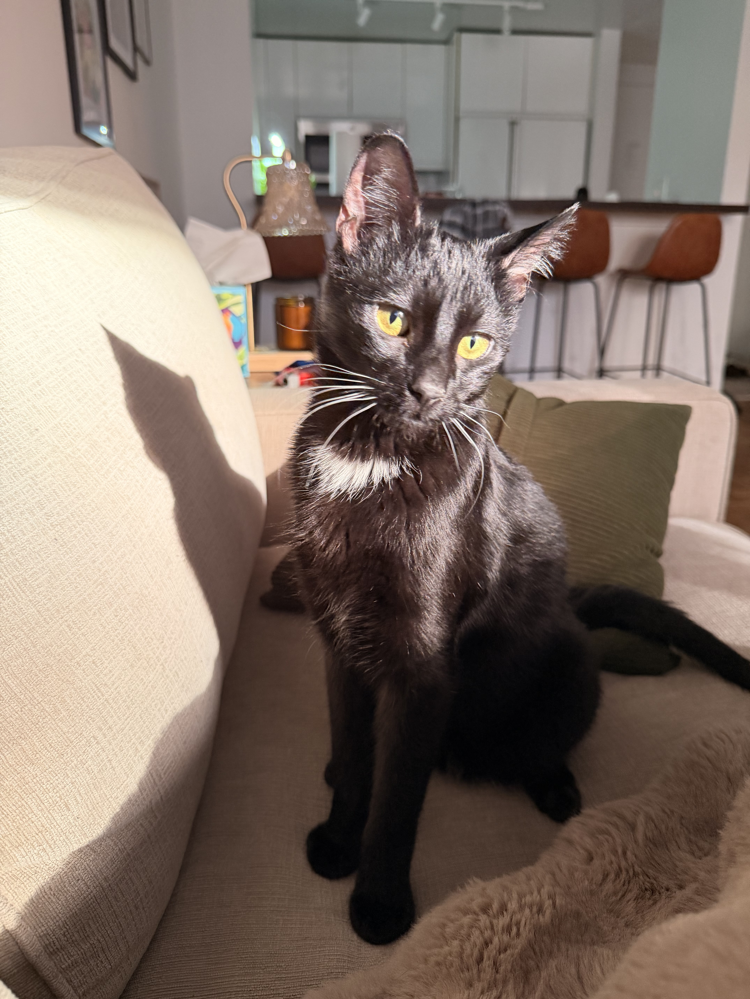

<div align="center">
  
</div>
<h3 align="center">
    <a href="#getting-started">Getting Started</a>
    <span> · </span>
    <a href="#why-use-agentcat-">Features</a>
    <span> · </span>
    <a href="https://docs.agentcat.com">Docs</a>
    <span> · </span>
    <a href="https://agentcat.com">Website</a>
    <span> · </span>
    <a href="#free-for-open-source">Open Source</a>
    <span> · </span>
    <a href="https://meet.agentcat.com/meet">Schedule a Demo</a>
</h3>
<p align="center">
  <a href="https://badge.fury.io/py/agentcat"></a>
  <a href="https://pypi.org/project/agentcat/"></a>
  <a href="https://opensource.org/licenses/MIT"></a>
  <a href="https://www.python.org/"></a>
  <a href="https://github.com/agentcathq/agentcat-python-sdk/issues"></a>
  <a href="https://github.com/agentcathq/agentcat-python-sdk/actions"></a>
</p>

> [!NOTE]
> AgentCat v2 introduces compatibility with the [MCP Protocol "Stateless" 2026-07-28 Update](https://blog.modelcontextprotocol.io/posts/2026-07-28/) and the coinciding [MCP Python SDK v2](https://github.com/modelcontextprotocol/python-sdk/releases) release that puts it into effect. The stateless transition has a massive impact on analytics, as sessions were a built-in concept tying related tool calls together. AgentCat has now migrated its session tracking under guidance of the MCP core team's recommendations of using [explicit handles (SEP-2567)](https://github.com/modelcontextprotocol/modelcontextprotocol/pull/2567).
>
> As a result AgentCat now injects a `session_id` on every MCP tool call to associate them under the same task umbrella. Our evals show much higher tool correlation accuracy at the cost of < 1% additional context pollution.

> [!IMPORTANT]
> **MCPcat is now AgentCat** 🐱 — same team, same product, new name. This package was previously published as [`mcpcat`](https://pypi.org/project/mcpcat/), which keeps working forever, but new features land here. Upgrading takes a few minutes — see the [migration guide](./MIGRATION.md).

AgentCat is an analytics platform for MCP server owners 🐱. It captures user intentions and behavior patterns to help you understand what AI users actually need from your tools — eliminating guesswork and accelerating product development all with one-line of code.

This SDK also provides a free and simple way to forward telemetry like logs, traces, and errors to any Open Telemetry collector or popular tools like Datadog and Sentry.

```bash
# Basic installation (includes official MCP SDK)
pip install agentcat

# With community FastMCP support
pip install "agentcat[community]"
```

To learn more about us, check us out [here](https://agentcat.com). For detailed guides visit our [documentation](https://docs.agentcat.com).

## Why use AgentCat? 🤔

AgentCat helps builders of MCP servers, Claude Connectors, and ChatGPT Plugins learn how to improve them by capturing any agents goals and detecting when they get stuck.

Use AgentCat for:

- **Agent session replay** 🎬. Follow alongside your users and their agents to understand why they're using your MCP servers, what functionality you're missing, and what clients they're coming from.
- **Trace debugging** 🔍. See where your users are getting stuck, track and find when LLMs get confused by your API, and debug sessions across all deployments of your MCP server.
- **Existing platform support** 📊. Get logging and tracing out of the box for your existing observability platforms (OpenTelemetry, Datadog, Sentry) — eliminating the tedious work of implementing telemetry yourself.


## How it works

AgentCat works as a lightweight middleware inside your MCP server. When you call `track()`, it seamlessly modifies your registered tool schemas in place, following the MCP core team's [explicit handles (SEP-2567)](https://github.com/modelcontextprotocol/modelcontextprotocol/pull/2567) guidelines. Concretely, AgentCat adds the following to your server:

- **`session_id`** — a parameter injected into each tool's input schema. Agents echo it back on every call, letting AgentCat group related tool calls into one task even over stateless transports. Values are validated: anything AgentCat did not issue is rejected rather than adopted, and the agent is told to re-send the ID it was given.
- **`agent_id`** _(off by default)_ — enabled with `enable_agent_tracking=True`. Each agent self-generates its own ID, keeping parallel agents working the same task individually attributable.
- **`context`** — a parameter asking the agent to explain, in one sentence, why it is making this call. This is where intent data comes from.
- **`get_more_tools`** — an additional tool, prompt-engineered so that agents readily report the features and tools they looked for but couldn't find — surfacing your missing functionality directly from real usage.

Injected parameters are stripped from arguments before your tool handler runs, so your code never sees them. For tools that declare an output schema, issued IDs are also mirrored into `structuredContent` (as `_mcp_instructions`), so clients that only read structured results still receive them.

## Getting Started

To get started with AgentCat, first create an account and obtain your project ID by signing up at [agentcat.com](https://agentcat.com). For detailed setup instructions visit our [documentation](https://docs.agentcat.com).

Once you have your project ID, integrate AgentCat into your MCP server:

```python
import agentcat
from mcp.server.mcpserver import MCPServer

server = MCPServer("echo-mcp", version="0.1.0")

@server.tool(description="Echo a message")
def echo(msg: str) -> str:
    return msg

# Track the server with AgentCat
agentcat.track(server, "proj_0000000")
```

Stateless servers built on [MCP 2026-07-28](https://blog.modelcontextprotocol.io/posts/2026-07-28/) create a fresh server instance per worker or per tenant, serving each request with `stateless_http=True`. Call `track()` inside the factory so every instance is tracked:

```python
import agentcat
from mcp.server.mcpserver import MCPServer

def create_server() -> MCPServer:
    server = MCPServer("echo-mcp", version="0.1.0")
    # register tools...
    agentcat.track(server, "proj_0000000")
    return server

server = create_server()
server.run(transport="streamable-http", stateless_http=True)
```

Calling `track()` per instance is cheap — the event queue, telemetry exporters, and diagnostics are initialized once and shared across instances.

### Identifying users

We strongly encourage identifying every actor. If you can't resolve a real user, return a stable anonymized ID instead — for example, a hash of the auth token or API key — so that all events from the same end user still roll up to one actor in your dashboard rather than scattering into anonymous one-off sessions.

`identify` (like every AgentCat hook) may be sync or async and runs on every tool call, ahead of your handler: a hook that fails outright — or returns anything that is not a `UserIdentity` — costs analytics data for that event, never the call itself. Every hook runs under a 5-second cap, and a slow lookup delays that call's response — so keep it cheap, and add your own caching if it does a database or API lookup.

The callback receives the tool call's `request` params (`.name` and `.arguments`, a plain dict) and the request context the SDK hands to handlers — the same `(request, extra)` shape on every supported server flavor. On HTTP transports, identity signals like headers and auth live on `extra.request`:

```python
from agentcat import AgentCatOptions, UserIdentity

async def identify(request, extra):
    http = getattr(extra, "request", None)  # incoming HTTP request, when present
    token = http.headers.get("authorization") if http else None
    org_id = http.headers.get("x-org-id") if http else None
    user = await myapi.get_user(token)
    if not user:
        return None
    return UserIdentity(user_id=user.id, user_name=user.name, user_data={"org_id": org_id})

agentcat.track(server, "proj_0000000", AgentCatOptions(identify=identify))
```

### Redacting sensitive data

AgentCat redacts all data sent to its servers and encrypts at rest, but for additional security, it offers a hook to do your own redaction on all text data returned back to our servers.

```python
from agentcat import AgentCatOptions

async def redact(text: str) -> str:
    return await redactor(text)
# or a plain sync function — both are supported

agentcat.track(server, "proj_0000000", AgentCatOptions(redact_sensitive_information=redact))
```

### Vendor Support

AgentCat seamlessly integrates with your existing observability stack, providing automatic logging and tracing without the tedious setup typically required. Export telemetry data to multiple platforms simultaneously:

```python
import os

from agentcat import AgentCatOptions

agentcat.track(
    server,
    "proj_0000",  # Project ID can optionally be None if you just want to forward telemetry
    AgentCatOptions(
        exporters={
            "otlp": {
                "type": "otlp",
                "endpoint": "http://localhost:4318/v1/traces",
            },
            "datadog": {
                "type": "datadog",
                "api_key": os.environ["DD_API_KEY"],
                "site": "datadoghq.com",
                "service": "my-mcp-server",
            },
            "sentry": {
                "type": "sentry",
                "dsn": os.environ["SENTRY_DSN"],
                "environment": "production",
            },
        }
    ),
)
```

Learn more about our free and open source [telemetry integrations](https://docs.agentcat.com/telemetry/integrations).

### Internal diagnostics

To help us catch and fix broken installs, the SDK sends AgentCat a small, anonymized
signal when setup or runtime errors occur — never your tool calls, your responses,
or anything about your users. Records carry only operational metadata, such as your
project ID (or an anonymous install ID when none is set). Your local `~/agentcat.log`
is unchanged.

Diagnostics are on by default and can be turned off completely with either:

- `track(server, project_id, AgentCatOptions(disable_diagnostics=True))`, or
- the `DISABLE_DIAGNOSTICS` environment variable.

## Free for open source

AgentCat is free for qualified open source projects. We believe in supporting the ecosystem that makes MCP possible. If you maintain an open source MCP server, you can access our full analytics platform at no cost.

**How to apply**: Email [hi@agentcat.com](mailto:hi@agentcat.com) with your repository link

_Already using AgentCat? We'll upgrade your account immediately._

## Community Cats 🐱

Meet the cats behind AgentCat! Add your cat to our community by submitting a PR with your cat's photo in the `docs/cats/` directory.

<div align="left">
  
  
  
</div>

_Want to add your cat? Create a PR adding your cat's photo to_ `docs/cats/` _and update this section!_
